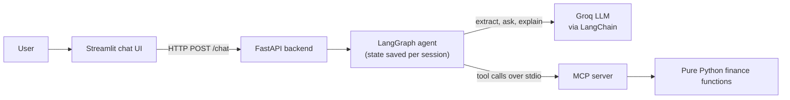
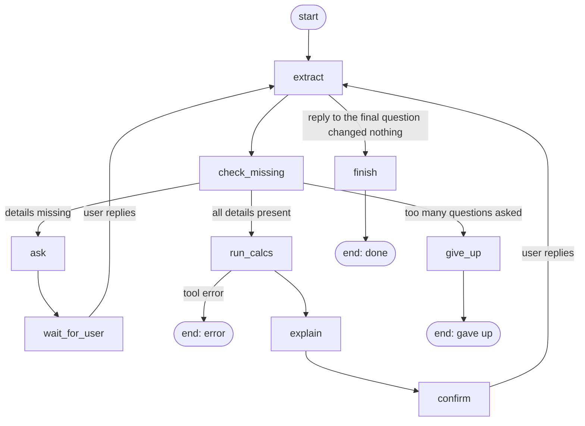
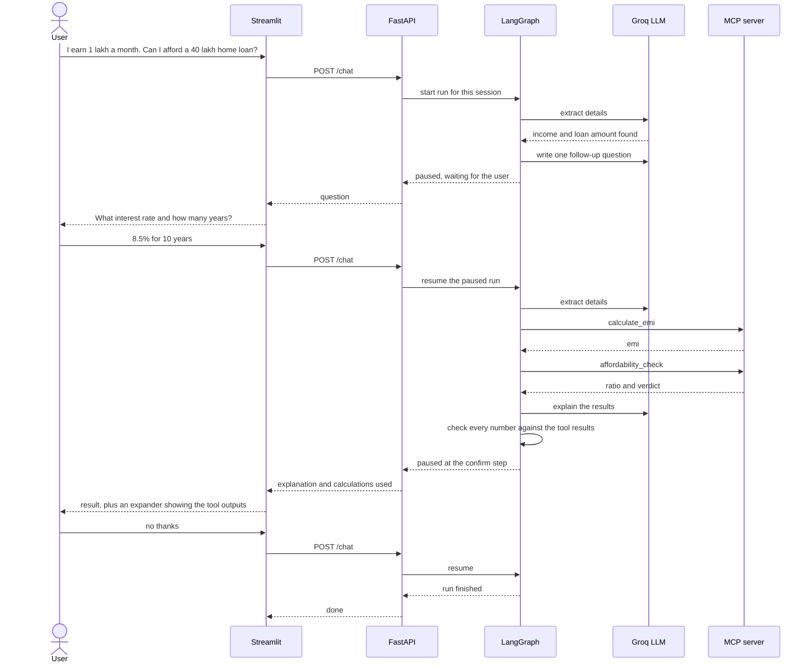

# Tallyman: Money Decision Copilot [Live Demo](https://tallyman-copilot.streamlit.app/)

A chat assistant for everyday money decisions in India. You describe a decision in plain words, it asks for whatever is missing, and then calculator tools do the maths. The language model only understands your message and explains the result. It never calculates.


Live - https://tallyman-copilot.streamlit.app/

## Contents

- [Introduction](#introduction)
- [What it can do](#what-it-can-do)
- [Tech stack](#tech-stack)
- [Architecture](#architecture)
- [How a conversation flows](#how-a-conversation-flows)
- [Keeping the numbers honest](#keeping-the-numbers-honest)
- [Project structure](#project-structure)
- [Testing and evaluation](#testing-and-evaluation)
- [Getting started](#getting-started)
- [Limitations and future work](#limitations-and-future-work)
- [Conclusion](#conclusion)
- [Author](#author)

## Introduction

Questions like "can I afford this loan?" or "which tax regime is better for me?" need real arithmetic, and language models are unreliable at arithmetic. Tallyman splits the work:

- The **language model** reads messy human input ("40L at 8.5% for 10 year, I earn 1 lakh a month"), asks follow-up questions, and explains results in simple words.
- **Deterministic tools** (a Python MCP server) do every calculation.
- A **LangGraph workflow** keeps the conversation on track: it remembers what you already said, asks only for what is missing, and lets you change an assumption afterwards.

The whole stack runs on free services: a Groq-hosted open-weight model, and Streamlit for hosting.

## What it can do

| Decision | Tools used | What you get |
|---|---|---|
| Can I afford this loan? | `calculate_emi`, `affordability_check` | Monthly EMI, share of income going to EMIs, and a comfortable / stretched / risky verdict |
| Old or new income tax regime? | `compare_tax_regimes` | Tax under both regimes and which one is cheaper |
| Prepay my loan or invest the extra money? | `prepay_vs_invest` | Final wealth under each option, which wins, and how many months early the loan would close |

Example (the wording is written by the model, the numbers come from the tools):

```
You:       I earn 1 lakh a month. Can I afford a 40 lakh home loan?
Tallyman:  What interest rate and how many years are you looking at?
You:       8.5% for 10 years
Tallyman:  A 40 lakh loan at 8.5% for 10 years has an EMI of about ₹49,594 a month.
           That is 49.6% of your monthly income, which looks stretched.
You:       what if the rate is 9%
Tallyman:  (recalculates with the new rate)
You:       no thanks
```

## Tech stack

| Tool | Role in this project | Why it is used here |
|---|---|---|
| **Python** | Everything | One language for the tools, the agent and the UI |
| **LangGraph** | The conversation workflow | The flow has a loop (extract, check what is missing, ask, repeat) and must pause for the user and resume later. LangGraph's checkpointer stores the state per session and `interrupt()` handles the pause |
| **LangChain** | Model access and structured extraction | A provider-agnostic chat model, and `with_structured_output` to turn free text into a validated Pydantic object |
| **MCP (Model Context Protocol)** | The calculator server | Puts the maths behind a clean tool boundary. The tools can be tested alone and reused by any MCP client |
| **FastAPI** | The backend API | Separates the agent from the UI, validates requests and responses with Pydantic, and gives interactive docs at `/docs` |
| **Groq** | The language model (free tier) | Fast open-weight model, default `openai/gpt-oss-120b` |
| **Streamlit** | The chat UI and hosting | Simple to build and free to deploy. It starts the FastAPI backend in a background thread, so everything runs as one app |
| **pytest** | Testing | Tests run without an API key |

## Architecture



**Design rules**

1. The model never produces a number that is not backed by a tool result (see [Keeping the numbers honest](#keeping-the-numbers-honest)).
2. The finance logic is plain Python with no LLM and no MCP in it. The MCP server is a thin layer on top, so the maths is easy to test.
3. Everything that touches the outside world (the LLM and the MCP tools) is injected into the graph. Tests swap in fakes, production plugs in the real thing.

### The conversation graph



| Node | What it does |
|---|---|
| `extract` | Uses the LLM with structured output to pull details out of the user's message and merge them into the saved details |
| `check_missing` | Plain Python. Compares the saved details with what the chosen decision needs |
| `ask` | The LLM writes one friendly follow-up question for the missing details |
| `wait_for_user` | Pauses the graph with `interrupt()` until the user answers |
| `run_calcs` | Calls the MCP tools for the chosen decision |
| `explain` | The LLM turns the tool results into plain words, then the numbers are verified |
| `confirm` | Pauses again: "want to change anything?" |
| `finish` / `give_up` | Ends the run (after 5 unanswered questions it stops asking) |

Two design choices worth knowing:

- `ask` and `wait_for_user` are separate nodes. When a LangGraph node resumes after an interrupt it re-runs from the top, so putting the LLM call and the interrupt in one node would pay for the call twice.
- The confirm step needs no extra LLM call. The reply goes through the same `extract` node. If it changes a detail (like the interest rate), the numbers are recalculated. If it changes nothing, the run ends.

### MCP tools

| Tool | Inputs | Returns |
|---|---|---|
| `calculate_emi` | principal, annual_rate, years | Monthly EMI |
| `amortization_summary` | principal, annual_rate, years | EMI, total interest, year-by-year balance |
| `affordability_check` | monthly_income, existing_emis, new_emi | EMI-to-income ratio and verdict |
| `compare_tax_regimes` | gross_income, deductions_old, fy | Tax and taxable income under old and new regimes, cheaper regime, savings |
| `prepay_vs_invest` | principal, loan_rate, years, extra_monthly, expected_return | Final wealth for both options, better option, months saved |

The server runs over stdio as a subprocess. You can poke at it by hand with the MCP Inspector:

```bash
npx @modelcontextprotocol/inspector python -m app.mcp_server.server
```

### API

| Endpoint | Purpose |
|---|---|
| `POST /chat` | Body: `{"session_id": "...", "message": "..."}`. Returns `reply`, `status` (`awaiting_input`, `done`, `gave_up`, `error`) and `tool_results` |
| `GET /session/{session_id}` | Current decision type, saved details and status (useful for debugging) |
| `GET /health` | Health check |

The session id is the LangGraph thread id, so every browser session has its own conversation state.

## How a conversation flows



## Keeping the numbers honest

A model can write a confident number that nobody calculated. To prevent that:

1. The explanation prompt says to use only the numbers in the data it is given.
2. After the model answers, every number in the text is compared with the numbers in the tool results and the user's inputs. Small tolerances are allowed for rounding and for forms like "₹40 lakh", "49.6%" or "8 years" for 97 months.
3. If a number cannot be traced to a tool result, the answer is regenerated once.
4. If it fails again, the app falls back to a plain template summary written in code, with no model-written numbers at all.

The same check is used in the tests: the fallback summary must pass its own check for all three decisions.

## Project structure

```
tallyman/
├── streamlit_app.py            # entrypoint: starts the API in a thread + chat UI
├── requirements.txt
├── requirements-dev.txt
├── pytest.ini
├── .env.example
├── app/
│   ├── core/
│   │   └── config.py           # settings from environment variables
│   ├── finance/                # pure functions: no LLM, no MCP
│   │   ├── loan.py             # EMI, amortization, affordability
│   │   ├── tax.py              # old vs new regime
│   │   ├── invest.py           # prepay vs invest
│   │   ├── tools.py            # the five tool functions (single source of truth)
│   │   └── tax_slabs.yaml      # slabs per financial year
│   ├── mcp_server/
│   │   └── server.py           # registers the tools, runs over stdio
│   ├── agent/
│   │   ├── state.py            # graph state and required details per decision
│   │   ├── nodes.py            # the graph nodes and routing rules
│   │   ├── graph.py            # builds the LangGraph workflow
│   │   ├── llm.py              # Groq model, extract / ask / explain functions
│   │   ├── prompts.py          # prompts
│   │   ├── grounding.py        # number checking and the fallback summary
│   │   └── mcp_client.py       # runs tool calls through the MCP server
│   └── api/
│       ├── main.py             # FastAPI app and routes
│       └── schemas.py          # request and response models
└── tests/
```

## Testing and evaluation

```bash
pytest
```

No API key or internet connection is needed to run the tests.

| Test file | Tests | What it checks |
|---|---|---|
| `test_finance.py` | 37 | EMI against a known value (40 lakh at 8.5% for 20 years is about ₹34,713), amortization totals, affordability thresholds, tax behaviour, prepay vs invest behaviour, and invalid inputs |
| `test_mcp_tools.py` | 5 | Starts the real MCP server over stdio and checks the tool list, schemas, results and error handling |
| `test_mcp_client.py` | 2 | The client that the agent uses to call tools, including clean errors |
| `test_graph_flow.py` | 5 | Asking for missing details, a one-message request, changing an assumption, giving up after repeated unanswered questions, and sessions not leaking into each other |
| `test_api.py` | 8 | A full conversation over HTTP, bad requests, session separation, and a clean 502 when the model fails |
| `test_grounding.py` | 14 | Indian number formatting, accepting real numbers, rejecting invented numbers, and the fallback summary |
| `test_extract_mapping.py` | 4 | Mapping of extracted details to the right fields |
| **Total** | **75** | |

How the tests are built:

- **Fakes instead of a live model.** The graph takes the LLM and tool functions as arguments, so tests run the real graph with scripted fakes and real finance maths. The results are deterministic.
- **Known values from an independent calculation.** The expected EMI and loan totals were computed separately and then written into the tests.
- **Property tests for tax.** Tax tests check behaviour (zero tax at low income, tax never falls as income rises, more deductions never raise old-regime tax) rather than copying numbers, so they stay valid when slabs change.
- **End-to-end over stdio.** The MCP tests start the actual server process, the same way the deployed app does.

What the automated tests do not cover:

- The quality of live model output (how well it extracts details and how clear its wording is). This is checked by hand with a short script of prompts: the three example prompts in the sidebar, a message with all details at once, a bare answer like "20", a mid-conversation change like "what if the rate is 9%", and a nonsense reply. Set `DEBUG_LLM=1` in `.env` to print what the model extracted for each message.
- Groq's free-tier rate limits.

## Getting started

### Run it locally

Requires Python 3.10 or newer (tested on 3.12 and 3.14) and a free [Groq API key](https://console.groq.com).

```bash
git clone https://github.com/YOUR-USERNAME/tallyman.git
cd tallyman

python -m venv .venv
source .venv/Scripts/activate      # Git Bash on Windows
# source .venv/bin/activate        # macOS / Linux

pip install -r requirements-dev.txt
cp .env.example .env
```

Open `.env` and set your key, then:

```bash
pytest                              # optional: should show 75 passed
streamlit run streamlit_app.py      # opens http://localhost:8501
```

To run only the API (without the UI):

```bash
uvicorn app.api.main:app --reload
```

then open http://127.0.0.1:8000/docs.

### Configuration

| Variable | Default | Meaning |
|---|---|---|
| `GROQ_API_KEY` | none | Your Groq key (required) |
| `GROQ_MODEL` | `openai/gpt-oss-120b` | Model name. Check Groq's model list, free models change |
| `GROQ_REASONING_EFFORT` | `low` | Keeps the model's thinking short to save free-tier tokens. Leave empty for models that do not support it |
| `DEBUG_LLM` | off | Set to `1` to print what the model extracted from each message |
| `API_PORT` | `8000` | Port for the backend that Streamlit starts |

### Deploy on Streamlit Community Cloud

1. Push the repository to GitHub (the `.env` file is in `.gitignore` and stays local).
2. On [share.streamlit.io](https://share.streamlit.io), create a new app from the repository with `streamlit_app.py` as the main file.
3. Under **Advanced settings → Secrets**, add:

```toml
GROQ_API_KEY = "your_key_here"
GROQ_MODEL = "openai/gpt-oss-120b"
```

## Limitations and future work

- Tax slabs are stored per financial year in `tax_slabs.yaml` and should be checked against the official income tax website. Surcharge for very high incomes is not modelled.
- The affordability verdict uses simple thresholds (comfortable up to 40% of income, stretched up to 50%, risky above that). These are rules of thumb, not lender rules.
- Salary given as "LPA" is a gross figure, so a monthly income worked out from it is higher than in-hand pay.
- There are no sanity limits on inputs yet, for example an interest rate of 900%.
- Sessions are kept in memory and reset when the server restarts.
- The free model tier has small rate limits, so heavy use will hit errors.
- Ideas for later: a persistent session store, input sanity checks, more decision types (SIP goals, rent vs buy), and an evaluation set of real prompts with expected details.

## Conclusion

Tallyman is a small project with one clear idea: let the language model handle language, and let code handle numbers. LangGraph gives the conversation memory and the ability to pause and resume, LangChain connects the model and turns text into structured data, an MCP server holds the calculators behind a tested tool boundary, FastAPI exposes it all as an API, and Streamlit makes it usable and free to host. The testing approach (injected fakes, known values, property tests, end-to-end tool tests) means the core logic can be verified without calling a model at all.

## Disclaimer

Tallyman gives educational estimates only. It is not financial, tax or investment advice. Check important decisions with a qualified professional.

## Author

Made by **Shakshyam Pandey**

Email: [shakshyampandey23@gmail.com](mailto:shakshyampandey23@gmail.com)